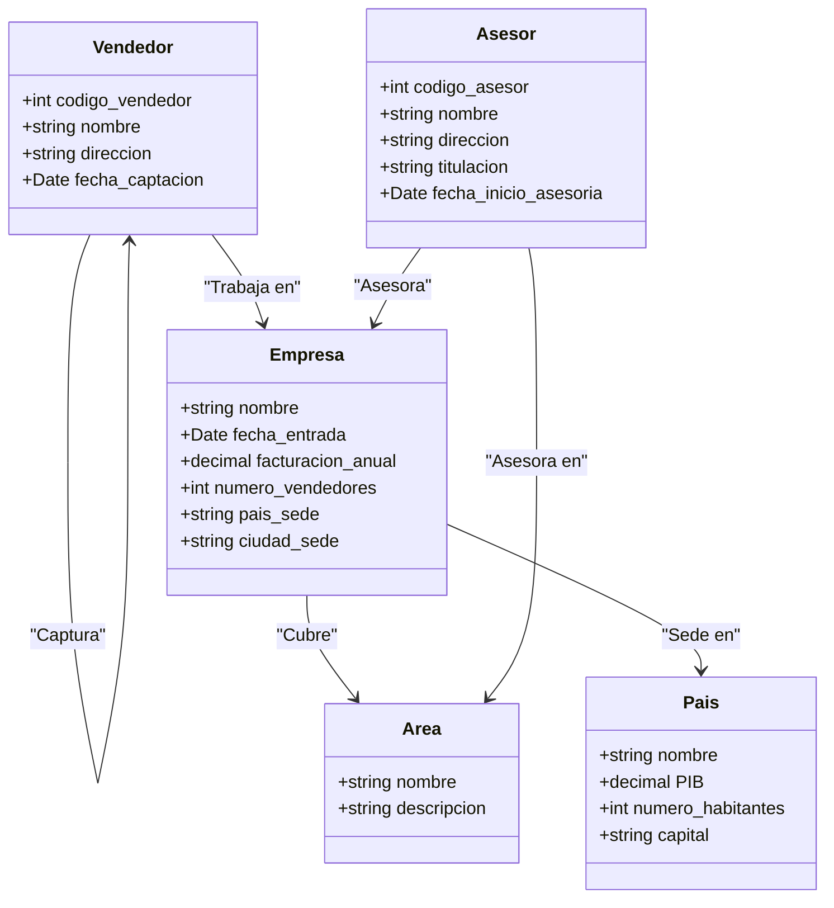

```mermaid
classDiagram
    class Vendedor {
        +int codigo_vendedor
        +string nombre
        +string direccion
        +Date fecha_captacion
    }
    
    class Empresa {
        +string nombre
        +Date fecha_entrada
        +decimal facturacion_anual
        +int numero_vendedores
        +string pais_sede
        +string ciudad_sede
    }
    
    class Area {
        +string nombre
        +string descripcion
    }

    class Pais {
        +string nombre
        +decimal PIB
        +int numero_habitantes
        +string capital
    }

    class Asesor {
        +int codigo_asesor
        +string nombre
        +string direccion
        +string titulacion
        +Date fecha_inicio_asesoria
    }

    Vendedor --> Vendedor : "Captura"
    Vendedor --> Empresa : "Trabaja en"
    Empresa --> Area : "Cubre"
    Empresa --> Pais : "Sede en"
    Asesor --> Empresa : "Asesora"
    Asesor --> Area : "Asesora en"
```