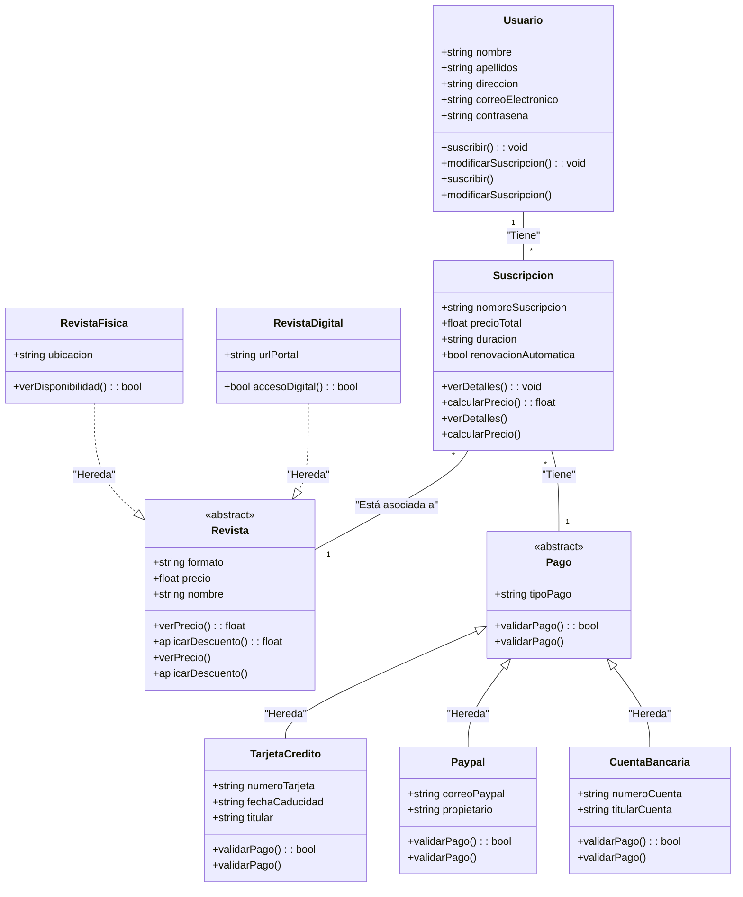

```mermaid
classDiagram
    %% Clases
    class Revista {
        <<abstract>>
        +string formato
        +float precio
        +string nombre
        +verPrecio(): float
        +aplicarDescuento(): float
    }

    class RevistaFisica {
        +string ubicacion
        +verDisponibilidad(): bool
    }

    class RevistaDigital {
        +string urlPortal
        +bool accesoDigital(): bool
    }

    class Suscripcion {
        +string nombreSuscripcion
        +float precioTotal
        +string duracion
        +bool renovacionAutomatica
        +verDetalles(): void
        +calcularPrecio(): float
    }

    class Usuario {
        +string nombre
        +string apellidos
        +string direccion
        +string correoElectronico
        +string contrasena
        +suscribir(): void
        +modificarSuscripcion(): void
    }

    class Pago {
        <<abstract>>
        +string tipoPago
        +validarPago(): bool
    }

    class TarjetaCredito {
        +string numeroTarjeta
        +string fechaCaducidad
        +string titular
        +validarPago(): bool
    }

    class Paypal {
        +string correoPaypal
        +string propietario
        +validarPago(): bool
    }

    class CuentaBancaria {
        +string numeroCuenta
        +string titularCuenta
        +validarPago(): bool
    }

    %% Relaciones
    Usuario "1" -- "*" Suscripcion : "Tiene"
    Suscripcion "*" -- "1" Revista : "Está asociada a"
    Suscripcion "*" -- "1" Pago : "Tiene"
    RevistaFisica ..|> Revista : "Hereda"
    RevistaDigital ..|> Revista : "Hereda"
    Pago <|-- TarjetaCredito : "Hereda"
    Pago <|-- Paypal : "Hereda"
    Pago <|-- CuentaBancaria : "Hereda"
    
    %% Métodos
    Usuario : +suscribir()
    Usuario : +modificarSuscripcion()
    Suscripcion : +verDetalles()
    Suscripcion : +calcularPrecio()
    Revista : +verPrecio()
    Revista : +aplicarDescuento()
    Pago : +validarPago()
    TarjetaCredito : +validarPago()
    Paypal : +validarPago()
    CuentaBancaria : +validarPago()

```