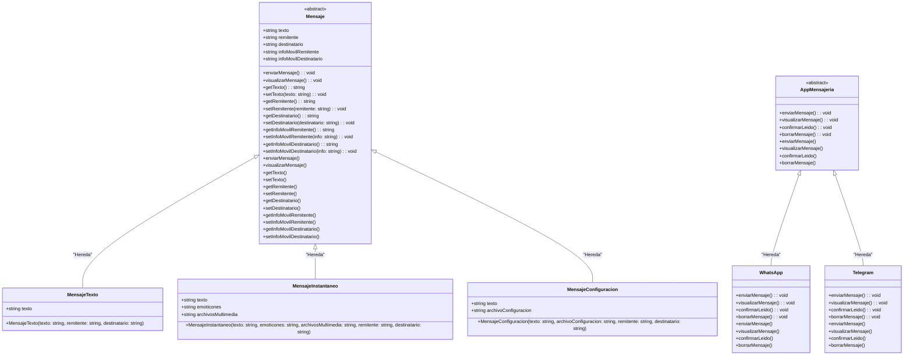

```mermaid

classDiagram
    %% Clases
    class Mensaje {
        <<abstract>>
        +string texto
        +string remitente
        +string destinatario
        +string infoMovilRemitente
        +string infoMovilDestinatario
        +enviarMensaje(): void
        +visualizarMensaje(): void
        +getTexto(): string
        +setTexto(texto: string): void
        +getRemitente(): string
        +setRemitente(remitente: string): void
        +getDestinatario(): string
        +setDestinatario(destinatario: string): void
        +getInfoMovilRemitente(): string
        +setInfoMovilRemitente(info: string): void
        +getInfoMovilDestinatario(): string
        +setInfoMovilDestinatario(info: string): void
    }

    class MensajeTexto {
        +string texto
        +MensajeTexto(texto: string, remitente: string, destinatario: string)
    }

    class MensajeInstantaneo {
        +string texto
        +string emoticones
        +string archivosMultimedia
        +MensajeInstantaneo(texto: string, emoticones: string, archivosMultimedia: string, remitente: string, destinatario: string)
    }

    class MensajeConfiguracion {
        +string texto
        +string archivoConfiguracion
        +MensajeConfiguracion(texto: string, archivoConfiguracion: string, remitente: string, destinatario: string)
    }

    class AppMensajeria {
        <<abstract>>
        +enviarMensaje(): void
        +visualizarMensaje(): void
        +confirmarLeido(): void
        +borrarMensaje(): void
    }

    class WhatsApp {
        +enviarMensaje(): void
        +visualizarMensaje(): void
        +confirmarLeido(): void
        +borrarMensaje(): void
    }

    class Telegram {
        +enviarMensaje(): void
        +visualizarMensaje(): void
        +confirmarLeido(): void
        +borrarMensaje(): void
    }

    %% Relaciones
    Mensaje <|-- MensajeTexto : "Hereda"
    Mensaje <|-- MensajeInstantaneo : "Hereda"
    Mensaje <|-- MensajeConfiguracion : "Hereda"
    AppMensajeria <|-- WhatsApp : "Hereda"
    AppMensajeria <|-- Telegram : "Hereda"

    %% Métodos comunes
    Mensaje : +enviarMensaje()
    Mensaje : +visualizarMensaje()
    Mensaje : +getTexto()
    Mensaje : +setTexto()
    Mensaje : +getRemitente()
    Mensaje : +setRemitente()
    Mensaje : +getDestinatario()
    Mensaje : +setDestinatario()
    Mensaje : +getInfoMovilRemitente()
    Mensaje : +setInfoMovilRemitente()
    Mensaje : +getInfoMovilDestinatario()
    Mensaje : +setInfoMovilDestinatario()

    AppMensajeria : +enviarMensaje()
    AppMensajeria : +visualizarMensaje()
    AppMensajeria : +confirmarLeido()
    AppMensajeria : +borrarMensaje()

    WhatsApp : +enviarMensaje()
    WhatsApp : +visualizarMensaje()
    WhatsApp : +confirmarLeido()
    WhatsApp : +borrarMensaje()

    Telegram : +enviarMensaje()
    Telegram : +visualizarMensaje()
    Telegram : +confirmarLeido()
    Telegram : +borrarMensaje()
```